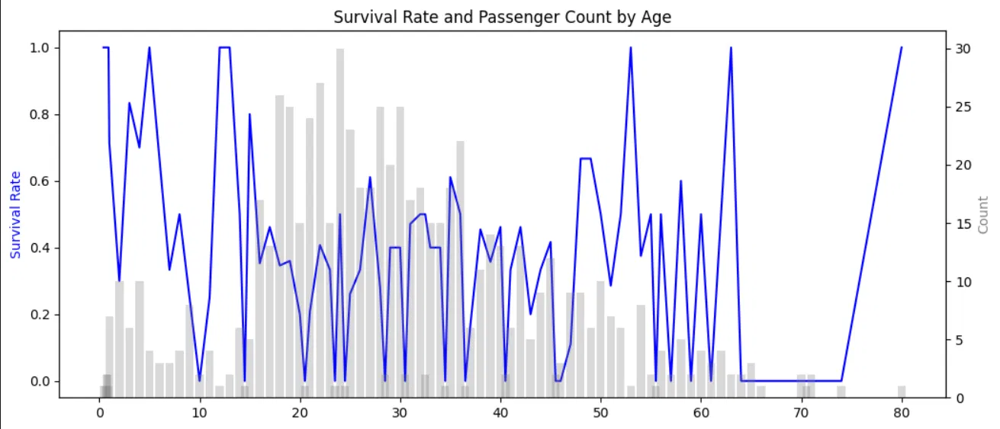
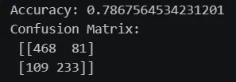
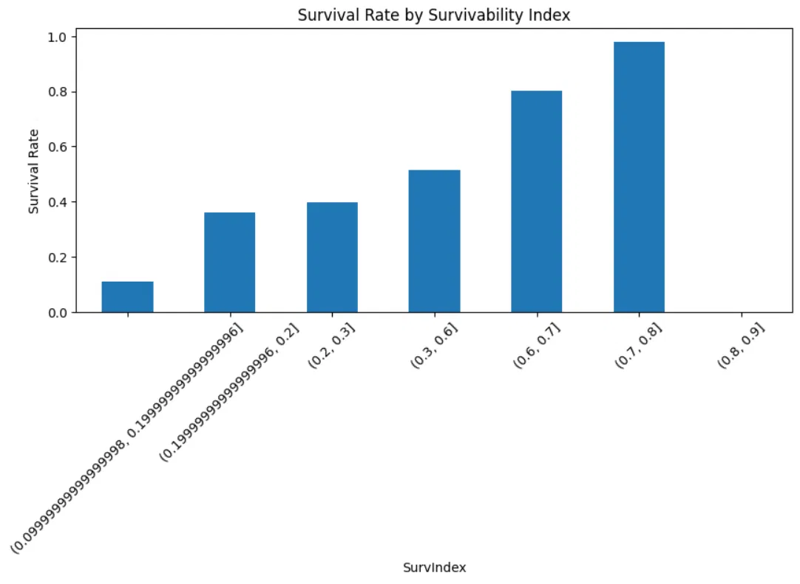
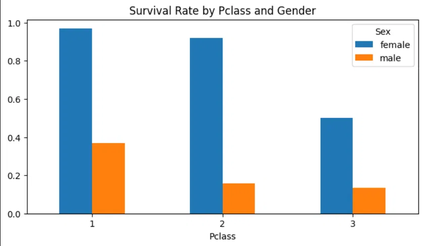
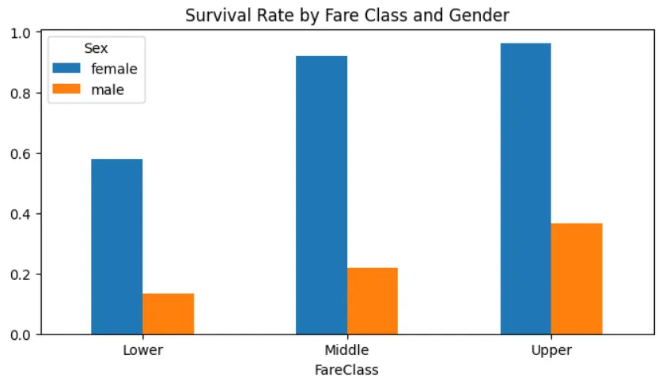
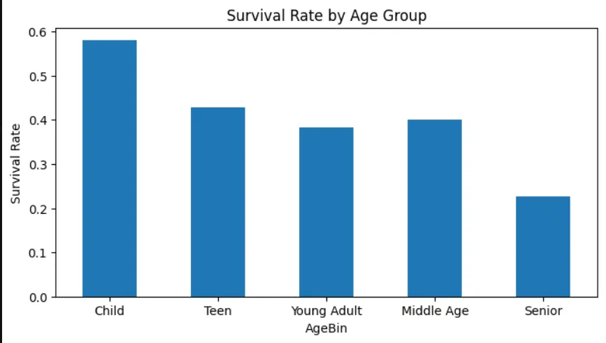

# titanic-ml

Exploratory analysis and survival prediction on the Titanic dataset, featuring a custom Survivability Index and comparison of multiple classification models.

## Overview

This project goes beyond baseline Titanic ML by building a composite **Survivability Index** — a weighted score derived from passenger class, sex, age, and fare — to rank survival likelihood before any model is trained. EDA covers age distributions, fare-class interactions, and gender-Pclass breakdowns. Multiple scikit-learn classifiers are then benchmarked against each other with accuracy scores and confusion matrices.

## Features

- **Deep EDA** — dual-axis age chart, age group survival rates, fare vs. class, and gender × Pclass breakdowns
- **Survivability Index** — custom composite metric that scores each passenger's survival likelihood from raw features
- **Multi-model comparison** — Logistic Regression, Decision Tree, and Random Forest evaluated side by side
- **Confusion matrix analysis** — per-model breakdown of true/false positives and negatives
- **Clean notebook flow** — reproducible end-to-end in a single Jupyter notebook

## Tech Stack

- Python 3, Jupyter Notebook
- pandas, NumPy
- matplotlib, seaborn
- scikit-learn

## Getting Started

```bash
git clone https://github.com/shashwatsrv/titanic-ml.git
cd titanic-ml
pip install pandas numpy matplotlib seaborn scikit-learn jupyter
jupyter notebook
```

Open `titanic.ipynb` and run all cells.

---

## Exploratory Data Analysis

### Survival Rate and Passenger Count by Age

Dual-axis chart showing survival rate (blue line) overlaid on passenger count (grey bars) across all ages.



### Survival Rate by Age Group

Children had the highest survival rate (~58%), while seniors had the lowest (~23%).



### Survival Rate by Fare Class and Gender

Across all fare tiers, females significantly outsurvived males. The gap narrows slightly in lower fare classes.



### Survival Rate by Pclass and Gender

1st class females survived at ~97%. Male survival dropped sharply regardless of class.



---

## Survivability Index

A custom composite score combining Pclass, Sex, Age, and Fare to rank each passenger's survival likelihood. Higher index bins show near-perfect survival rates, validating the metric's predictive power.



---

## Results

**Accuracy: 78.67%**

```
Confusion Matrix:
[[468  81]
 [109 233]]
```



The model correctly identified 468 non-survivors and 233 survivors. The Survivability Index aligned closely with model predictions — passengers in 1st class, female, and younger age groups consistently scored highest, matching historical survival patterns.
